## Sequence Diagram
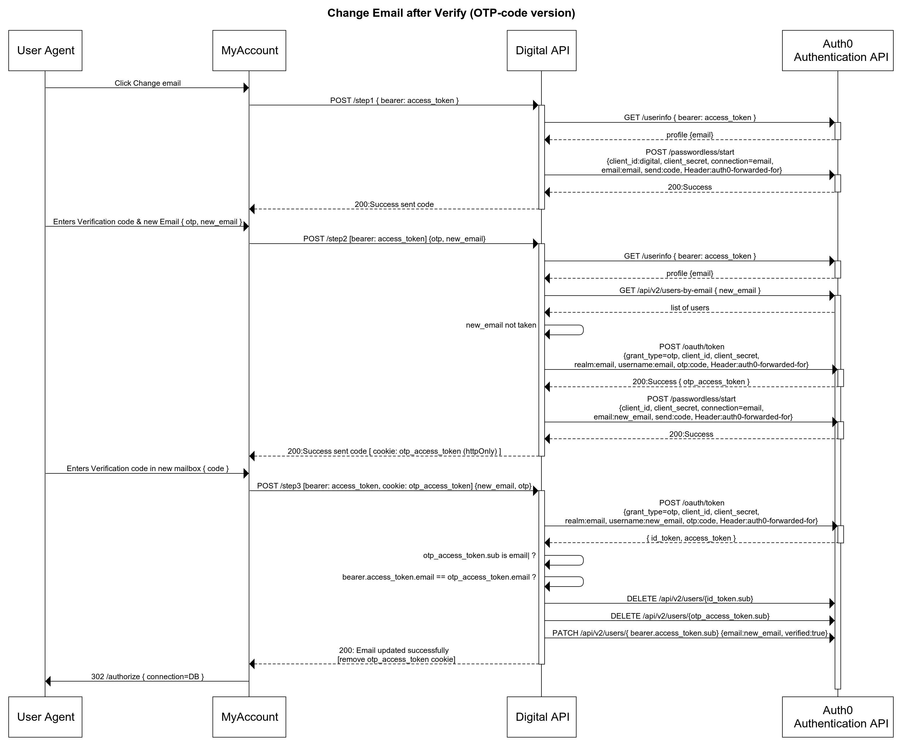

#### Why this approach?
Change email is a high risk operation. Here are some reasoning behind this approach:

1. Change email leaves a track (email) in both current and new mailbox. i.e. any temporarily change won't go unnoticed.
2. Ownership to both mailboxes are guaranteed using OTP code, eliminating any chance of a typo
3. OTP is generally more secure compared to the magic link. No accidental verification by virus-scanner or other browser plugins       
4. UX optionally designed as SPA. Easy to add to any existing MyAccount portal 

```
Notes: Not suitable if you already using Passwordless for normal login 
```

## Setup
copy and populate 
1. `env-sample` => `.env`
2. `auth_config.json-sample` => `auth_config.json`

## Running
Clone the project first.

```bash
$ composer install

$ php -S localhost:3000 
```

## Client Creation
This sample requires two clients
1. SPA client for front-end application. `client_id` goes into `auth_config.json` file
2. Regular Web Application client for back-end API. `client_id` and `client_secret` goes into `.env` file

### SPA Client
- Type: SPA
- Grant(s): Authorization Code
- Connection(s): Database
- Allowed Callback and Logout URLs: `http://localhost:3000`

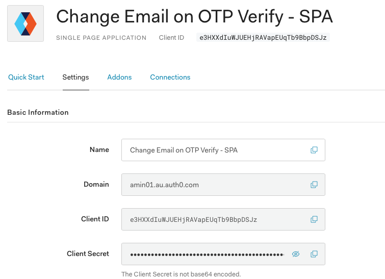

### API Client
- Type: RWA
- Grant(s): Passwordless OTP, Client Credentials
- Connection(s): Database, *Passwordless Email*
- API & scopes: *Management API* with following scopes
    - `read:users`
    - `update:users`
    - `delete:users`

##### Application  
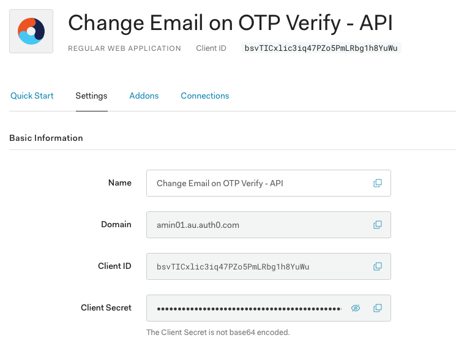

##### Grants
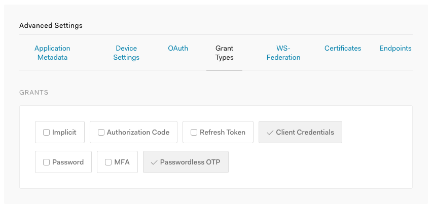

##### Connection
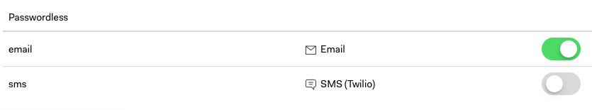
  
##### Scopes
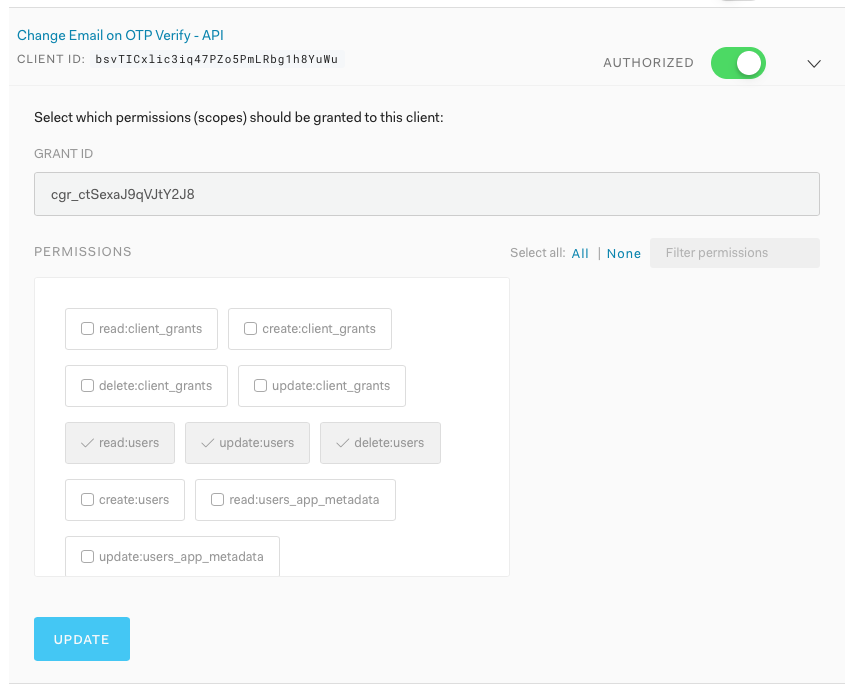

## Steps

### Step 1
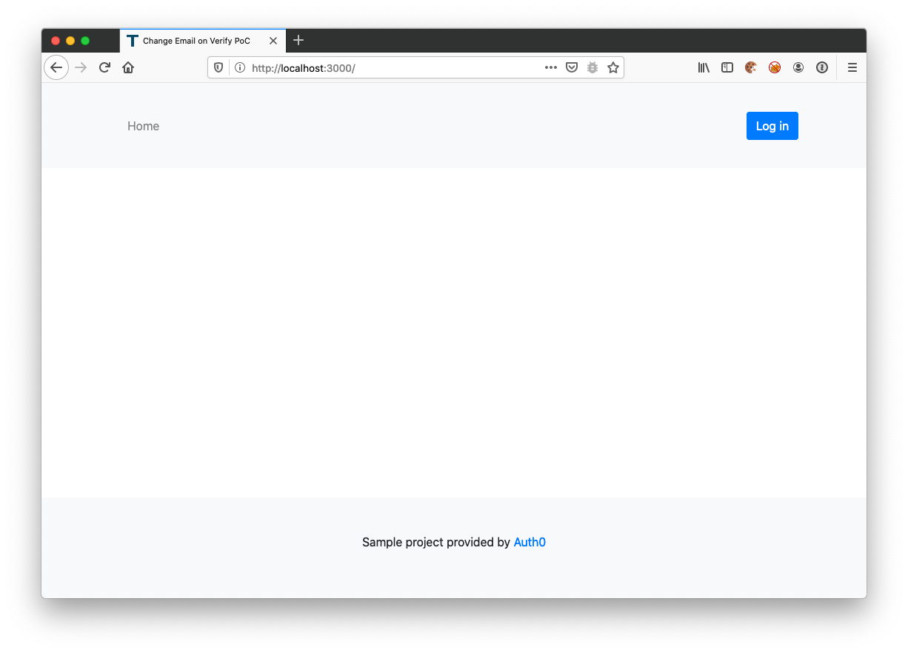

### Step 2
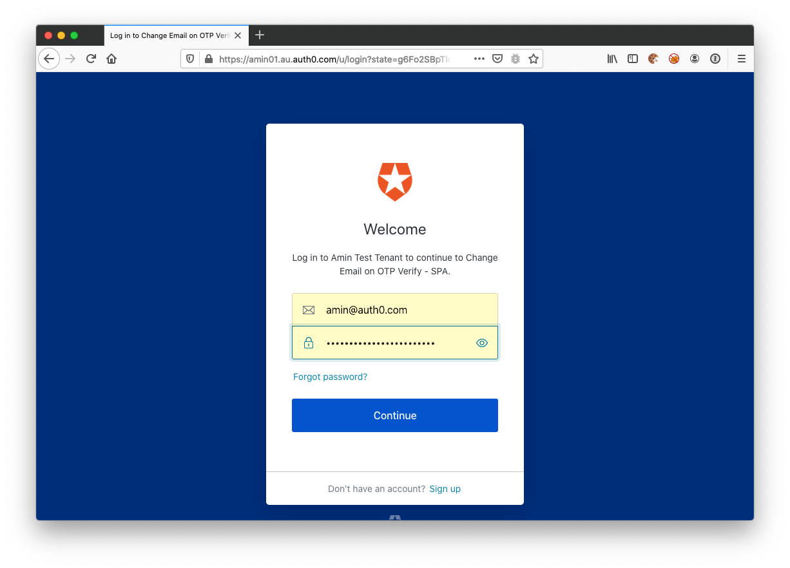

### Step 3
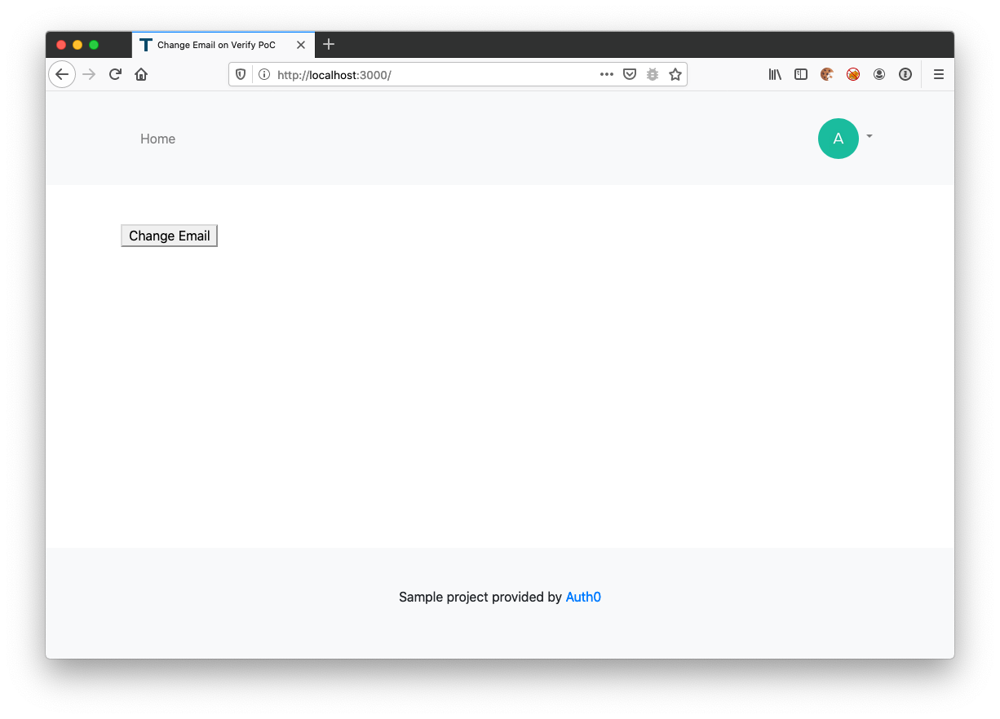

### Step 4
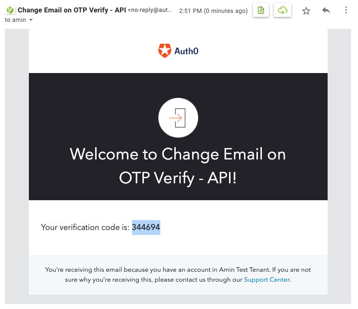

### Step 5
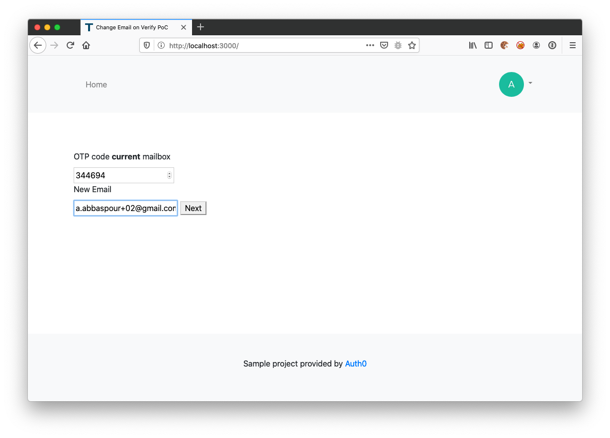

### Step 6
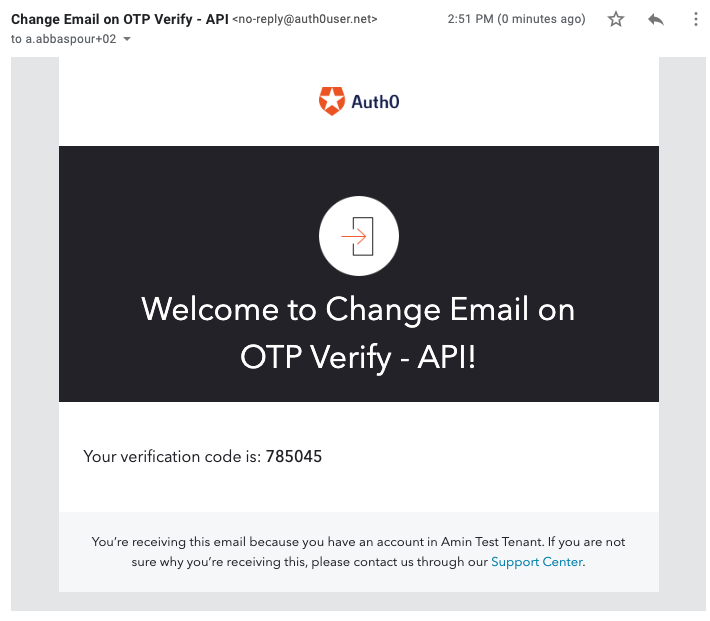

### Step 7
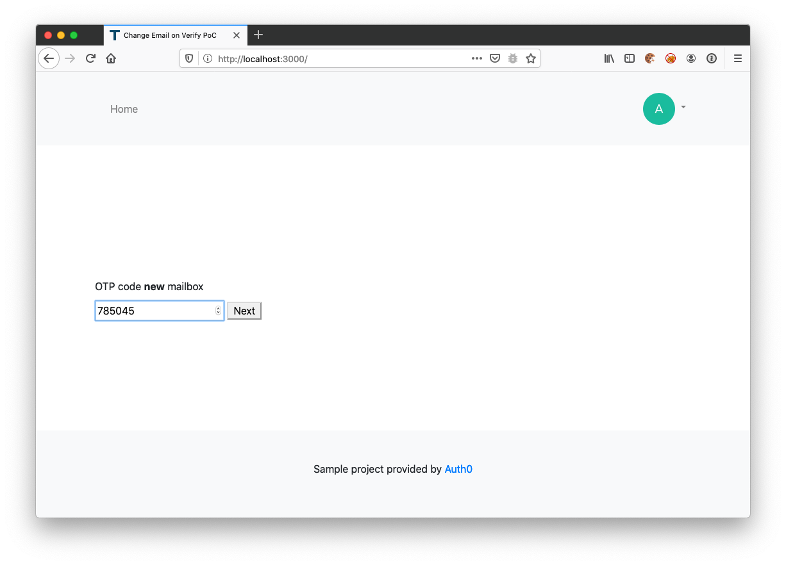

### Step 8
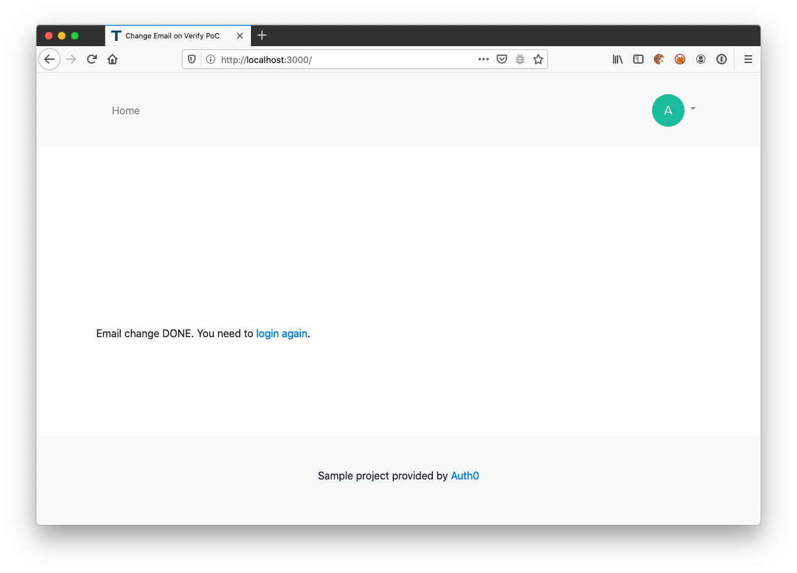

### Step 9


### Step 10
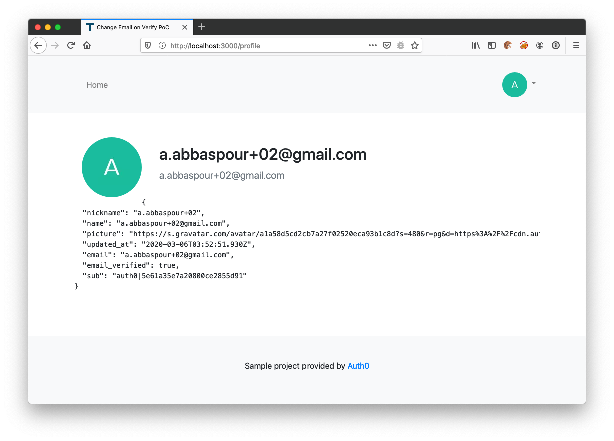


## What is Auth0?

Auth0 helps you to:

* Add authentication with [multiple authentication sources](https://docs.auth0.com/identityproviders), either social like **Google, Facebook, Microsoft Account, LinkedIn, GitHub, Twitter, Box, Salesforce, amont others**, or enterprise identity systems like **Windows Azure AD, Google Apps, Active Directory, ADFS or any SAML Identity Provider**.
* Add authentication through more traditional **[username/password databases](https://docs.auth0.com/mysql-connection-tutorial)**.
* Add support for **[linking different user accounts](https://docs.auth0.com/link-accounts)** with the same user.
* Support for generating signed [Json Web Tokens](https://docs.auth0.com/jwt) to call your APIs and **flow the user identity** securely.
* Analytics of how, when and where users are logging in.
* Pull data from other sources and add it to the user profile, through [JavaScript rules](https://docs.auth0.com/rules).

## Create a free account in Auth0

1. Go to [Auth0](https://auth0.com) and click Sign Up.
2. Use Google, GitHub or Microsoft Account to login.

## Issue Reporting

If you have found a bug or if you have a feature request, please report them at this repository issues section. Please do not report security vulnerabilities on the public GitHub issue tracker. The [Responsible Disclosure Program](https://auth0.com/whitehat) details the procedure for disclosing security issues.

## Author

[Auth0](https://auth0.com)

## License

This project is licensed under the MIT license. See the [LICENSE](LICENSE.txt) file for more info.
